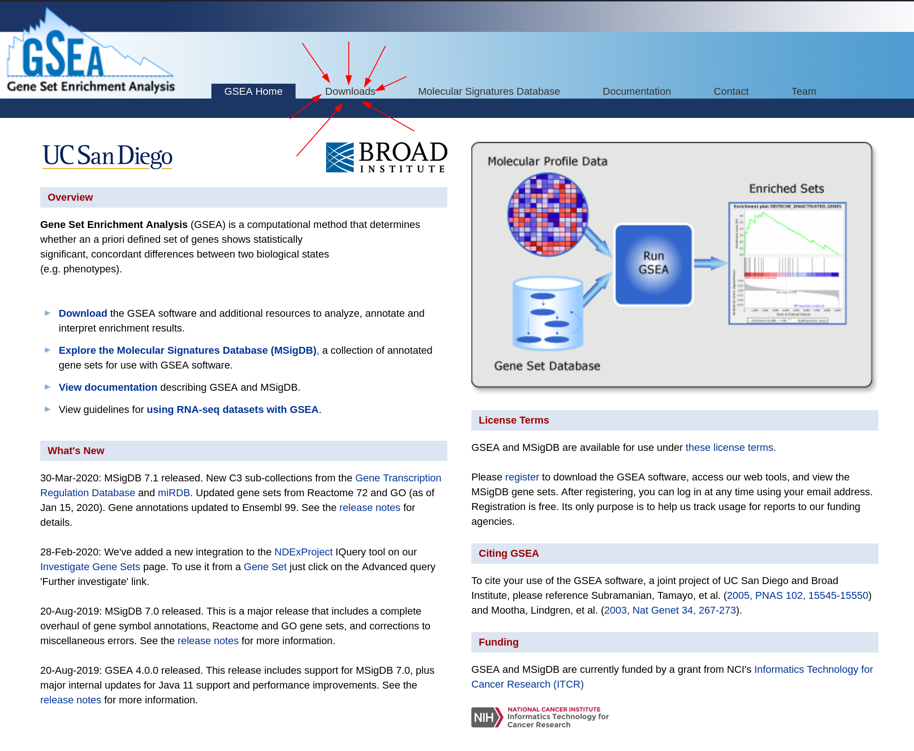
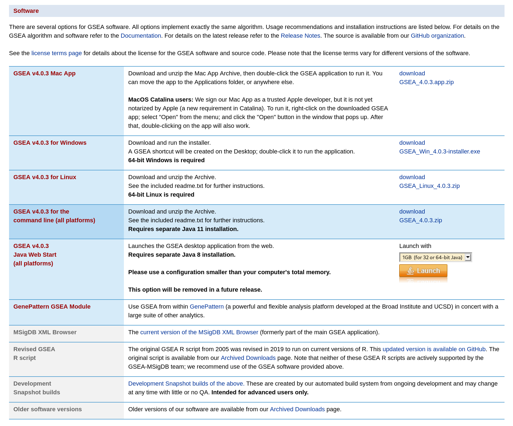
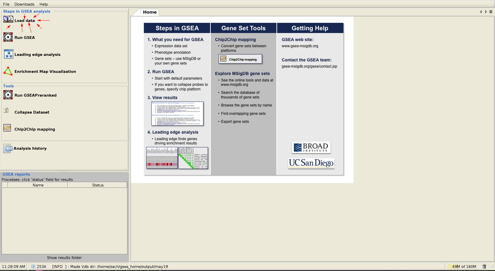
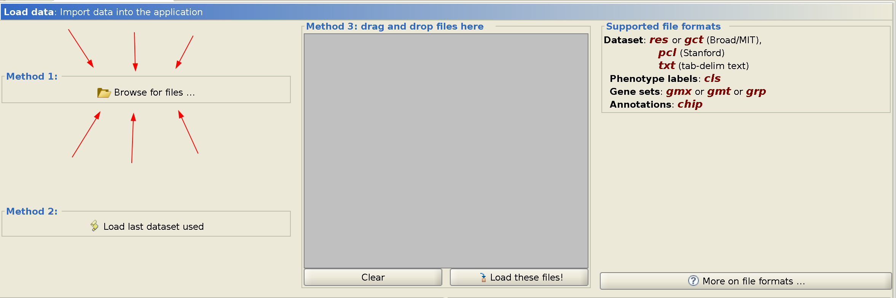
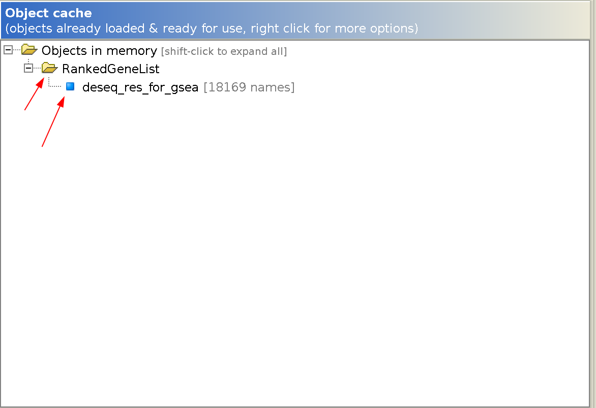

# Running GSEA (Gene Set Enrichment Analysis)

GSEA (gene set enrichment analysis) is a powerful tool for analyzing
relative changes in expression of sets of genes compared to random
background. In other words, it allows you to figure out which pathways
in your data are changing.

In our lab, GSEA is most commonly used for analyzing the significant
results from DESeq2, although it can work with any data that provides
a list of common gene identifiers and an number to show relative
position in that list.

## Step 0 - Prepare your Data

For this guide, we'll get the data from DESeq2. Here I'm assuming that
you have a `DESeq2::results()` object called `res`. Below is some code
to generate and export a data frame for GSEA's pre-ranked mode. We use
a metric of `-log(p)` multiplied by the sign of the log fold change,
so that more significant things have a higher value and the sign of the
value is correct

```R
## In the following code we generate a ranked data frame with the gene
## names as the first column. The second column is the negative log-p
## value multiplied by the sign of the fold change.
rnkdf <- tibble(gene = rownames(res),
				rnk = -log(res$pvalue) * sign(res$log2FoldChange)) %>%
	arrange(desc(rnk)) %>% drop_na()

## Write out the table without any additional information
write.table(rnkdf, file = "deseq_res_for_gsea.rnk"),
			append = FALSE, col.names = FALSE, row.names = FALSE,
			quote = FALSE, sep = "\t")
```

This will make a 2 column tab-delimited file called
`deseq_res_for_gsea.rnk` that we will use later to run GSEA.

## Step 1 - Download and Install

To download GSEA, go to [the gsea
website](https://www.gsea-msigdb.org/gsea/index.jsp) and click on the
downloads link at the top.



You will have to register to download the software. Once you've
registered, you will be able to download the software for your
platform.



If you are on Mac or Windows, you can use the native installer
provided. Go ahead and walk through the steps. On Linux, just extract
the archive and run the `gsea.sh` command. The archive you download
might also include the command line version of the software, which we
will discuss using later.

## Step 2 - Run Preranked using GUI

When you open GSEA, you will be presented with the following homepage.
First we need to load our data. In the folder containing this document
you can find a sample `deseq_res_for_gsea.rnk` in the folder that this
document is in. First, click the button that says 'Load data'.



Click on the button that says browse for files and find your
`deseq_res_for_gsea.rnk` wherever you downloaded it on your system.



When you load it, the data will show up in the box on the lower right
hand of your screen.



With the data loaded, we can now run the GSEA Preranked algorithm.
Click on the button on the left side to go to that screen now.


On this screen, click the `...` button on the side of 'Gene sets database'.


For this analysis, we're going to use the hallmarks database, which is
the first item in the list. This database contains the most
well-defined sets of biological interest.


Since our data set already has common gene symbols, we don't need the
`ChIP Platform` field to contain anything. However, we do need to
change the `Collapse/Remap gene symbols` option to say `No_collapse`.
This stops GSEA from trying to convert gene symbols for us.
Additionally, under the `basic fields` heading, you might want to
change the name of your analysis. This also tells you where the final
output will be saved.


When you're satisfied with your settings, click the button at the
bottom labeled 'run' to run your analysis.


In the bottom left of the window you can see the status of your
analyses, with the most recent one on the bottom.


When your data has finished running, you can go to the directory
indicated in your settings to see the output. The easiest way is to
copy the file path for `index.html` and paste it into your browser.
