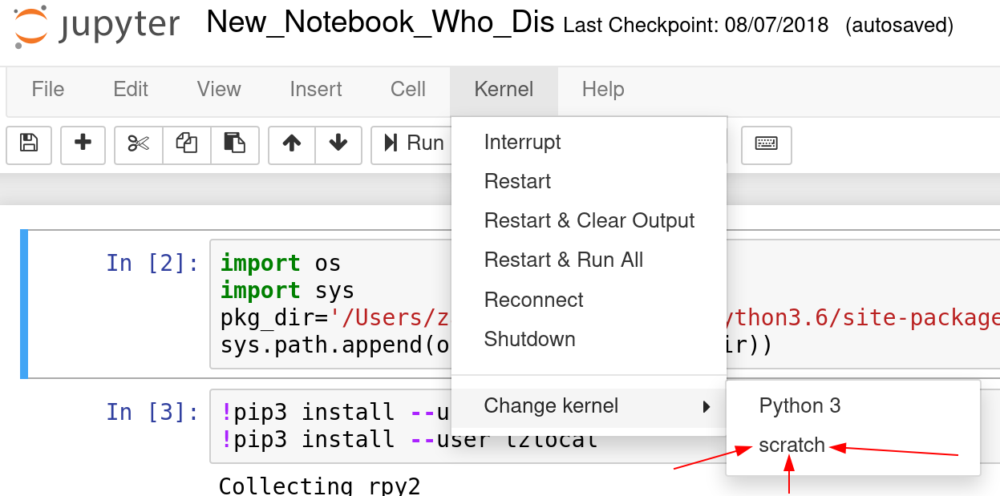

# Working With Python on FIJI

Working with python on FIJI is a huge pain. Today we'll go over the
basics of setting things up so that it's not quite so painful. Today
we'll go over:
- Making sure that pip is available for your user
- Installing packages on your own user account
- Setting up virtual environments (easy, medium, and hard)
- Managing different python versions

## Setting up pip in the first place

Unfortunately, the python packages provided with FIJI don't always
work well with pip. You can fix this by running:

```shell
module load python/3.6.3 # Pick your favorite python version
python3 -m ensurepip --user # Install pip in your user directory
```

When you do this, python installs a copy of pip to `~/.local/`. To use
this version of pip, you need to add the following to your `~/.bash_profile`:

```shell
export PATH=$PATH:"$HOME"/.local/bin
```

With this done, you should be able to install python packages normally
using pip. From now on you can install whatever you want by using the
`--user` flag for pip. Try to test it by running:

```shell
source ~/.bash_profile # Load the changes we just made
pip install --user numpy # Install a package
pip show --user # Show all your installed packages
```

## Virtual environments, from hard to easy

Virtual environments allow you to keep separate installations of
python for different projects. By doing this, you can keep fixed
versions of your dependencies for tools that need them. We'll walk
through the hard way to do this, then an easier way.

### The hard way

Python includes built-in tools for creating virtual environments, but
the tools are a little clunky. You can create a virtual environment
and activate it using the build in tools using the following commands:
```shell
python -m venv my_virtualenv # Create a virtual environment in the folder my_virtualenv
source my_virtualenv/bin/activate # Activate the virtual environment
which python # Check to see which version of python is active
```

If you need to use python 2 packages inside a virtual environment,
you'll have to install the `virtualenv` tool using pip. The built-in
venv tool was only added in python 3, so versions before need a
separate package. The `virtualenv` tool works just like the built in
`venv` tool:
```shell
pip install --user virtualenv # Install the tool
virtualenv my_virtualenv # Create a virtual environment in the folder my_virtualenv
source my_virtualenv/bin/activate # Activate the virtual environment
which python # Check to see which version of python is active
```

### The easy way

While the tools above are pretty simple, they don't provide a lot of
convenience, since you'll have to source the `$VENV/bin/activate` file
every time you want to work on it. Instead of this, you can use
`virtualenvwrapper`, which is a tool that has a few advantages:
1. It keeps all your virtual environments in a single folder in your
   home directory
2. It gives you easy commands to create new environments and work with
   them
3. It automatically handles certain important package installation and
   setup in new virtual environments.

The setup for `virtualenvwrapper` is a little bit more in depth than
the previous two tools because it needs to hook into your shell
configuration to manage things.
```shell
pip install --user virtualenv # Install the tool
```

Then, add the following to your `~/.bash_profile`:
```
export VIRTUALENVWRAPPER_PYTHON=python3
export WORKON_HOME=$HOME/.virtualenvs
export VIRTUALENVWRAPPER_SCRIPT=~/.local/bin/virtualenvwrapper.sh
source ~/.local/bin/virtualenvwrapper_lazy.sh
```

Once this is done, you can log out and log back in, or just run
`source ~/.bash_profile` to load your new settings. Then, you can
easily manage virtual environments and intelligently change your shell
settings:
```shell
mkvirtualenv scratch # Make a new virtualenv called 'scratch'
# Your command line should now have (scratch) at the start
# This means that you're inside the virtualenv
deactivate # This makes you leave the virtual environment
lsvirtualenv # List your virtual environments
workon scratch # Start working in the 'scratch' environment
```

## Working with Jupyter

No matter how you set up your virtual environment, you can easily
configure it to work with Jupyter on fiji in just a few easy steps.
This can save you a lot of pain when working with different projects
that have different dependency requirements. Here's how to do it:
```shell
workon scratch # Activate whatever virtual environment you want to use
pip install --user ipykernel # Install the ipython kernel package in the venv
python -m ipykernel install --user --name=scratch # Make your new kernel
```

This will make a new Jupyter kernel installed at
`~/.local/share/jupyter/kernels`. Then, you can go and easily use your
virtual environment for any notebook you already have:



## More advanced tools

- pipenv
- pyenv
- pipx
- poetry
